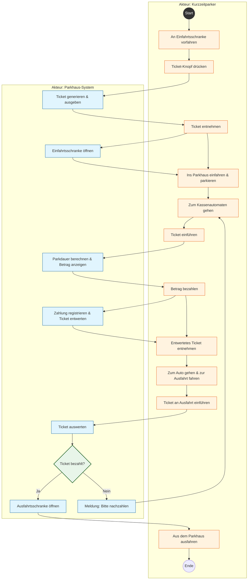

# Aktivitätsdiagramm

```mermaid
flowchart TD
    %% Swimlane für den Kunden
    subgraph Kunde [Akteur: Kurzzeitparker]
        Start((Start)) --> Ankunft[An Einfahrtsschranke vorfahren]
        Ankunft --> Knopf[Ticket-Knopf drücken]
        TicketNehmen[Ticket entnehmen] --> Einfahren[Ins Parkhaus einfahren & parkieren]
        Einfahren --> ZumKassenautomat[Zum Kassenautomaten gehen]
        ZumKassenautomat --> TicketReinKasse[Ticket einführen]
        Bezahlen[Betrag bezahlen] --> TicketZurueck[Entwertetes Ticket entnehmen]
        TicketZurueck --> ZurAusfahrt[Zum Auto gehen & zur Ausfahrt fahren]
        ZurAusfahrt --> TicketReinAusfahrt[Ticket an Ausfahrt einführen]
        Ausfahren[Aus dem Parkhaus ausfahren] --> Ende((Ende))
    end

    %% Swimlane für das System / die Hardware
    subgraph System [Akteur: Parkhaus-System]
        TicketDrucken[Ticket generieren & ausgeben]
        SchrankeAufEinfahrt[Einfahrtsschranke öffnen]
        BetragBerechnen[Parkdauer berechnen & Betrag anzeigen]
        ZahlungVerarbeiten[Zahlung registrieren & Ticket entwerten]
        TicketPruefen[Ticket auswerten]
        Entscheidung{Ticket bezahlt?}
        SchrankeAufAusfahrt[Ausfahrtsschranke öffnen]
        FehlerAnzeigen[Meldung: Bitte nachzahlen]
    end

    %% Prozessfluss / Interaktionen zwischen Kunde und System
    Knopf --> TicketDrucken
    TicketDrucken --> TicketNehmen
    TicketNehmen --> SchrankeAufEinfahrt
    SchrankeAufEinfahrt --> Einfahren

    TicketReinKasse --> BetragBerechnen
    BetragBerechnen --> Bezahlen
    Bezahlen --> ZahlungVerarbeiten
    ZahlungVerarbeiten --> TicketZurueck

    TicketReinAusfahrt --> TicketPruefen
    TicketPruefen --> Entscheidung
    Entscheidung -- Ja --> SchrankeAufAusfahrt
    Entscheidung -- Nein --> FehlerAnzeigen
    FehlerAnzeigen --> ZumKassenautomat
    SchrankeAufAusfahrt --> Ausfahren

    %% Styling (Optional, macht es etwas hübscher)
    classDef startEnd fill:#333,stroke:#333,stroke-width:2px,color:#fff;
    classDef systemAction fill:#e1f5fe,stroke:#01579b,stroke-width:1px;
    classDef customerAction fill:#fff3e0,stroke:#e65100,stroke-width:1px;
    classDef decision fill:#e8f5e9,stroke:#1b5e20,stroke-width:2px;

    class Start,End startEnd;
    class TicketDrucken,SchrankeAufEinfahrt,BetragBerechnen,ZahlungVerarbeiten,TicketPruefen,SchrankeAufAusfahrt,FehlerAnzeigen systemAction;
    class Ankunft,Knopf,TicketNehmen,Einfahren,ZumKassenautomat,TicketReinKasse,Bezahlen,TicketZurueck,ZurAusfahrt,TicketReinAusfahrt,Ausfahren customerAction;
    class Entscheidung decision;
```
