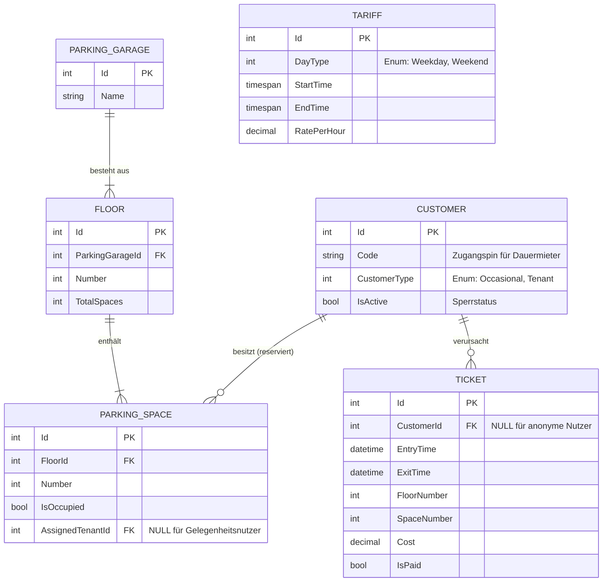

## 2.8 Modellierung der Datenbank

In diesem Kapitel wird das relationale Datenmodell der «EasyParking»-Software detailliert beschrieben. Das Modell bildet die konzeptionelle Grundlage für die Datenspeicherung und stellt sicher, dass alle geschäftsrelevanten Informationen strukturiert und konsistent abgebildet werden.

### 2.8.1 Entity-Relationship-Diagramm (ERD)

Das nachfolgende ER-Diagramm visualisiert die Tabellenstruktur, die Attribute sowie die Beziehungen zwischen den Entitäten des Systems.

### 2.8.2 Beschreibung der Fachentitäten

Die Datenbankstruktur wurde so entworfen, dass sie sowohl die physische Realität des Parkhauses als auch die geschäftlichen Anforderungen (Tarifierung, Kundenverwaltung) präzise abbildet:

*   **ParkingGarage & Floor:** Bilden die physische Hierarchie ab. Diese Struktur ermöglicht es, das System später problemlos auf mehrere Parkhäuser mit unterschiedlicher Anzahl an Stockwerken zu erweitern.
*   **ParkingSpace:** Das zentrale Element der Parkplatzverwaltung. Über das Attribut `AssignedTenantId` wird die exklusive Reservierung für Dauermieter technisch umgesetzt. Ist dieses Feld gefüllt, wird der Platz vom automatischen Zuteilungs-Algorithmus für Gelegenheitsnutzer ignoriert.
*   **Customer:** Speichert die Benutzerdaten. Die Unterscheidung zwischen Gelegenheitsnutzern (meist anonym im System, ausser für das Ticket-Tracking) und Dauermietern erfolgt über den `CustomerType`. Das Attribut `IsActive` dient als "Kill-Switch" für die automatische Sperrung bei Zahlungsverzug (**FA-40.2**).
*   **Ticket:** Fungiert als Transaktionsprotokoll. Es verknüpft die zeitlichen Daten (`EntryTime`, `ExitTime`) mit dem physischen Ort (`FloorNumber`, `SpaceNumber`) und dem finanziellen Status.
*   **Tariff:** Eine eigenständige Stammdatentabelle, die die dynamische Preisberechnung ermöglicht. Durch die Trennung von `DayType` (Wochentag/Wochenende) und Zeitfenstern kann die `TariffService`-Logik flexibel auf Änderungen der Preispolitik reagieren.
