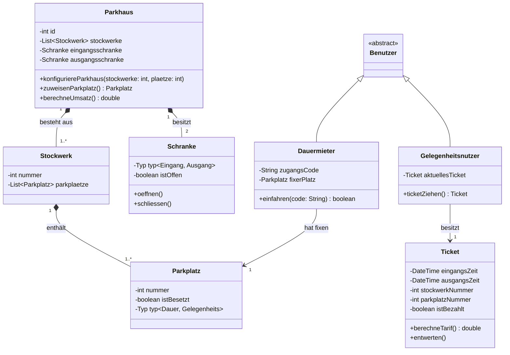
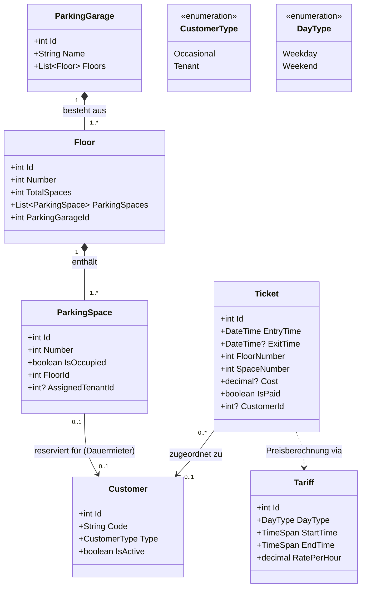

# Klassendiagramm (Struktur / Datenmodell)

## Klassendiagramm bevor Umsetzung

Das Klassendiagramm bildet die Kernanforderungen ab: Ein Parkhaus hat mehrere Stockwerke , welche wiederum aus mehreren Parkplätzen bestehen. Wir trennen sauber zwischen Dauermieter (mit Code und fixem Platz) und Gelegenheitsnutzer (mit Ticket).

Erklärung für deine Doku: Dieses Diagramm zeigt auf, dass das Parkhaus logisch über genau eine Eingangsschranke und eine Ausgangsschranke verfügt. Ebenso ist ersichtlich, dass das Ticket alle geforderten Attribute (Eingangszeit, Stockwerk, Parkplatznummer) speichert , damit später der 15-Minuten-Tarif bzw. die Tagespauschale berechnet werden kann.

Ein kleiner Tipp am Rande für unser Review: Vergiss nicht, in deiner Dokumentation kurz zu begründen, warum du diese Diagramme so aufgebaut hast. Die Dozenten lieben es, wenn man Entscheidungen nachvollziehbar dokumentiert ("Wir haben uns für eine Vererbung bei den Benutzern entschieden, weil..."). Das gibt ordentlich Pluspunkte bei der Bewertung der Architektur!

## Klassendiagramm nach Umsetzung

Dieses Klassendiagramm bildet den aktuellen Stand der Implementierung (As-Built) ab. Es entspricht der Datenbankstruktur, wie sie durch Entity Framework Core (Code-First) in der SQLite-Datenbank `easyparking.db` generiert wird.

## Erläuterungen für die Dokumentation

Die Modellierung wurde gegenüber dem ersten Entwurf verfeinert, um eine effiziente Persistenz und die komplexen Tarifanforderungen abzubilden:

1. **Vermeidung von Vererbung (Customer):** Anstelle einer komplexen Klassen-Hierarchie wird ein `CustomerType` verwendet. Dies vereinfacht die Abbildung in der relationalen Datenbank (Table-per-Hierarchy) und reicht für die Unterscheidung zwischen Gelegenheitsnutzern und Dauermietern vollkommen aus.
2. **Entkopplung der Tarife:** Die Klasse `Tariff` erlaubt es, die in der Aufgabenstellung geforderten Tarife (Wochentage vs. Wochenende/Feiertage) flexibel in der Datenbank zu hinterlegen und zu verwalten.
3. **Ticket-Historie:** Das `Ticket` fungiert als zentrales Protokoll-Element. Es speichert nicht nur die Zeiten (Einfahrt/Ausfahrt), sondern auch den finalen berechneten Betrag und die Stellplatz-Informationen, was für spätere statistische Auswertungen (Umsatz pro Monat/Jahr) essenziell ist.
4. **Referenzielle Integrität:** Die Relationen (z. B. `AssignedTenantId` auf einem `ParkingSpace`) stellen sicher, dass Dauermieter ihren fixen Platz behalten, während das System gleichzeitig die Belegung durch Gelegenheitsnutzer überwacht.
