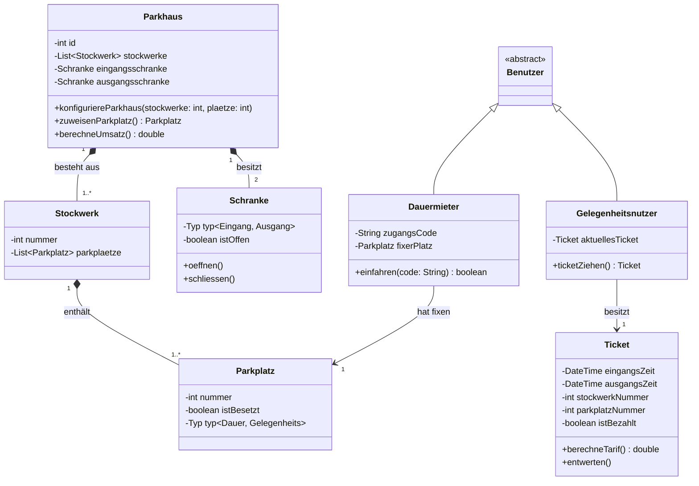

# Klassendiagramm (Struktur / Datenmodell)

Das Klassendiagramm bildet die Kernanforderungen ab: Ein Parkhaus hat mehrere Stockwerke , welche wiederum aus mehreren Parkplätzen bestehen. Wir trennen sauber zwischen Dauermieter (mit Code und fixem Platz) und Gelegenheitsnutzer (mit Ticket).

Erklärung für deine Doku: Dieses Diagramm zeigt auf, dass das Parkhaus logisch über genau eine Eingangsschranke und eine Ausgangsschranke verfügt. Ebenso ist ersichtlich, dass das Ticket alle geforderten Attribute (Eingangszeit, Stockwerk, Parkplatznummer) speichert , damit später der 15-Minuten-Tarif bzw. die Tagespauschale berechnet werden kann.

Ein kleiner Tipp am Rande für unser Review: Vergiss nicht, in deiner Dokumentation kurz zu begründen, warum du diese Diagramme so aufgebaut hast. Die Dozenten lieben es, wenn man Entscheidungen nachvollziehbar dokumentiert ("Wir haben uns für eine Vererbung bei den Benutzern entschieden, weil..."). Das gibt ordentlich Pluspunkte bei der Bewertung der Architektur!
