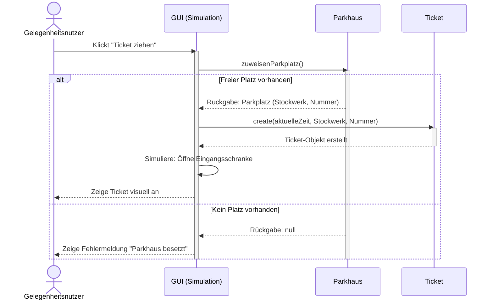
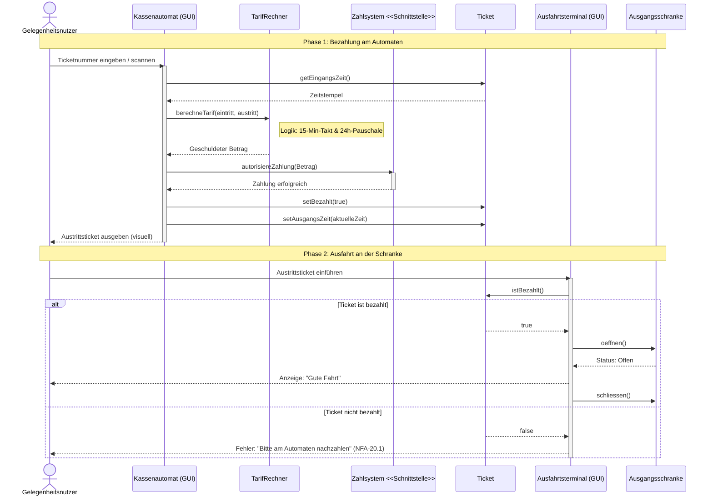

# Sequenzdiagramme

## (Dynamik: Einfahrt Gelegenheitsnutzer)

Um dem Dozenten zu zeigen, wie dein System in Aktion funktioniert (und wie die Objekte miteinander interagieren), ist ein Sequenzdiagramm für den "First-Free-Spot"-Algorithmus ideal. Es simuliert die Hardware-Komponenten (Ticketautomat/Schranke) am Bildschirm.

Erklärung für deine Doku:
Dieses Sequenzdiagramm dokumentiert den Ablauf von Anforderung FA-30.1 (automatisierte Zuweisung) und FA-60.4 (visuelle Darstellung des Tickets auf dem Bildschirm). Es zeigt deutlich, dass der Gelegenheitsnutzer nur dann ein Ticket erhält, sofern ein freier Platz verfügbar ist.

## Bezahlung & Ausfahrt

Dieses Diagramm zeigt den Ablauf für einen Gelegenheitsnutzer. Es berücksichtigt die Anforderung, dass das Ticket entwertet wird (), die Hardware simuliert wird () und das Zahlsystem nur über eine Schnittstelle angebunden ist ().

### Logik-Check: Der Tarif-Rechner (FA-40)

Die Anforderungen FA-40.6 bis FA-40.10 sind knifflig zu programmieren: Du musst im 15-Minuten-Takt abrechnen (), angebrochene Viertelstunden voll verrechnen () und bei über 24 Stunden auf die Tagespauschale von CHF 35.00 wechseln ().Damit du deine Algorithmen in der Phase "Kernfunktionen" (ab dem 20.04. laut Zeitplan) direkt überprüfen kannst, habe ich dir diesen Rechner erstellt:Der Rechner hilft dir, die Logik für dein Pflichtenheft präzise zu beschreiben und sicherzustellen, dass die Rundungsregeln korrekt angewendet werden.Es hilft auch dabei, die Anforderungen FA-40.6 bis FA-40.10 zu verstehen und im Prototyp umzusetzen.Tipps für die Dokumentation (nach ):Begründung der Schnittstelle: Erwähne in der Projektdokumentation explizit, dass das Zahlsystem eine externe Schnittstelle ist, um die Komplexität des Prototyps gering zu halten. Das zeigt, dass du "Systemabgrenzung" verstanden hast.Fehlerbehandlung: Ergänze im Sequenzdiagramm oder im Text, was passiert, wenn das Ticket nicht bezahlt ist (NFA-20.1: System darf nicht abstürzen, sondern muss Fehlermeldung ausgeben ).Passt das so für dein Design-Kapitel, oder brauchst du noch ein Zustandsdiagramm (State Chart) für den Status eines Parkplatzes (frei/besetzt/reserviert)?
