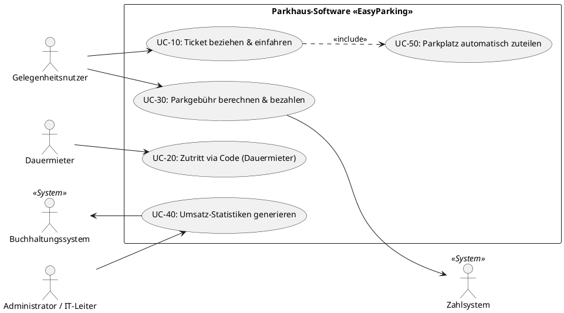

# Use Case Diagramm

```plantuml
@startuml
left to right direction
skinparam packageStyle rectangle

' Definition der menschlichen Akteure
actor "Gelegenheitsnutzer" as GN
actor "Dauermieter" as DM

' Definition der technischen Umsysteme (Schnittstellen)
actor "Zahlsystem" as ZS <<System>>
actor "Buchhaltungssystem" as BS <<System>>

' Systemgrenze
rectangle "Parkhaus-Software «EasyParking»" {

  ' Use Cases gemäss unseren funktionalen Anforderungen
  usecase "UC-10: Ticket beziehen & einfahren" as UC10
  usecase "UC-20: Zutritt via Code (Dauermieter)" as UC20
  usecase "UC-30: Parkgebühr berechnen & bezahlen" as UC30
  usecase "UC-40: Umsatz-Statistiken generieren" as UC40
  usecase "UC-50: Parkplatz automatisch zuteilen" as UC50

  ' Include-Beziehung (Ticket ziehen beinhaltet immer die Parkplatzzuteilung)
  UC10 ..> UC50 : <<include>>
}

' Zuweisung der Akteure zu den Use Cases
GN --> UC10
GN --> UC30

DM --> UC20

UC30 --> ZS
BS <-- UC40

' Administratoren (implizit für Statistiken)
actor "Administrator / IT-Leiter" as Admin
Admin --> UC40

@enduml
```
