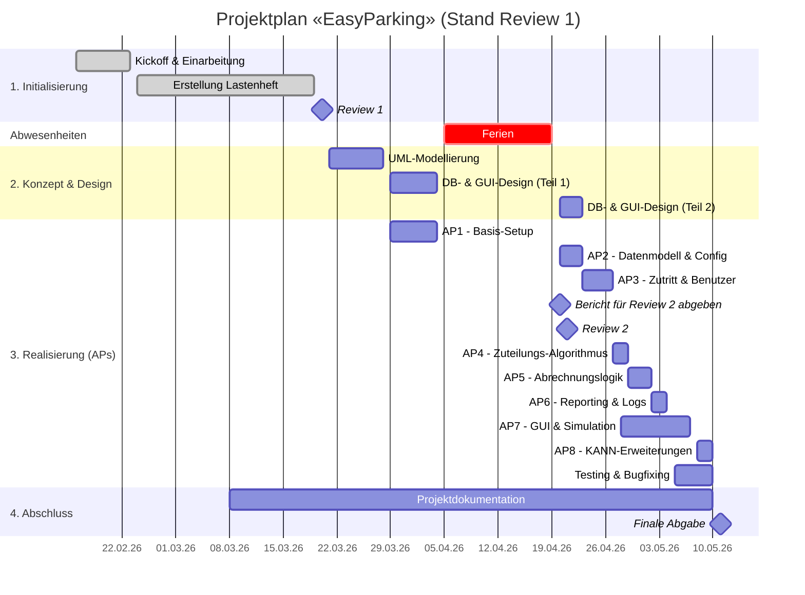
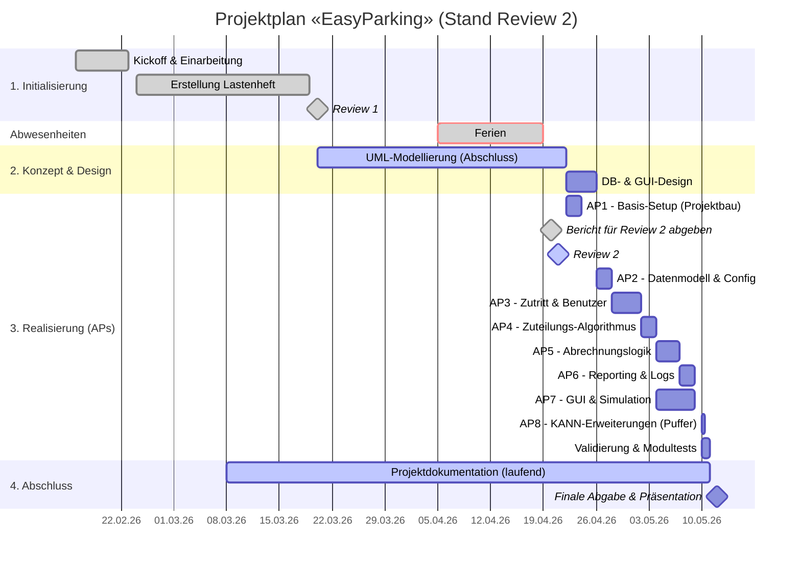

# Zeitplan

Visualisiert mit [Mermaid Viewer](https://mermaid.ai/play)

## Stand Review 1

```mermaid
gantt
    title Projektplan «EasyParking» (Stand Review 1)
    dateFormat  DD.MM.YYYY
    axisFormat  %d.%m.%y
    tickInterval 1w

    section 1. Initialisierung
    Kickoff & Einarbeitung         :done, 16.02.2026, 23.02.2026
    Erstellung Lastenheft          :done, 24.02.2026, 19.03.2026
    Review 1                       :milestone, 20.03.2026, 0d

    section Abwesenheiten
    Ferien                         :crit, 05.04.2026, 19.04.2026

    section 2. Konzept & Design
    UML-Modellierung               :21.03.2026, 28.03.2026
    DB- & GUI-Design (Teil 1)      :29.03.2026, 04.04.2026
    DB- & GUI-Design (Teil 2)      :20.04.2026, 23.04.2026

    section 3. Realisierung (APs)
    AP1 - Basis-Setup              :29.03.2026, 04.04.2026
    AP2 - Datenmodell & Config     :20.04.2026, 3d
    AP3 - Zutritt & Benutzer       :23.04.2026, 4d
    Bericht für Review 2 abgeben   :milestone, 20.04.2026, 0d
    Review 2                       :milestone, 21.04.2026, 0d
    AP4 - Zuteilungs-Algorithmus   :27.04.2026, 2d
    AP5 - Abrechnungslogik         :29.04.2026, 3d
    AP6 - Reporting & Logs         :02.05.2026, 2d
    AP7 - GUI & Simulation         :28.04.2026, 07.05.2026
    AP8 - KANN-Erweiterungen       :08.05.2026, 2d
    Testing & Bugfixing            :05.05.2026, 10.05.2026

    section 4. Abschluss
    Projektdokumentation           :08.03.2026, 10.05.2026
    Finale Abgabe                  :milestone, 11.05.2026, 0d
```

## Stand Review 2

```mermaid
gantt
    title Projektplan «EasyParking» (Stand Review 2)
    dateFormat  DD.MM.YYYY
    axisFormat  %d.%m.%y
    tickInterval 1w

    section 1. Initialisierung
    Kickoff & Einarbeitung          :done, 16.02.2026, 23.02.2026
    Erstellung Lastenheft           :done, 24.02.2026, 19.03.2026
    Review 1                        :milestone, done, 20.03.2026, 0d

    section Abwesenheiten
    Ferien                          :crit, done, 05.04.2026, 19.04.2026

    section 2. Konzept & Design
    UML-Modellierung (Abschluss)    :active, 20.03.2026, 22.04.2026
    DB- & GUI-Design                :22.04.2026, 26.04.2026

    section 3. Realisierung (APs)
    AP1 - Basis-Setup (Projektbau)  :22.04.2026, 2d
    Bericht für Review 2 abgeben    :milestone, done, 20.04.2026, 0d
    Review 2                        :milestone, active, 21.04.2026, 0d
    AP2 - Datenmodell & Config      :26.04.2026, 2d
    AP3 - Zutritt & Benutzer        :28.04.2026, 4d
    AP4 - Zuteilungs-Algorithmus    :02.05.2026, 2d
    AP5 - Abrechnungslogik          :04.05.2026, 3d
    AP6 - Reporting & Logs          :07.05.2026, 2d
    AP7 - GUI & Simulation          :04.05.2026, 09.05.2026
    AP8 - KANN-Erweiterungen (Puffer):10.05.2026, 8h
    Validierung & Modultests        :10.05.2026, 11.05.2026

    section 4. Abschluss
    Projektdokumentation (laufend)  :active, 08.03.2026, 11.05.2026
    Finale Abgabe & Präsentation    :milestone, 12.05.2026, 0d
```
