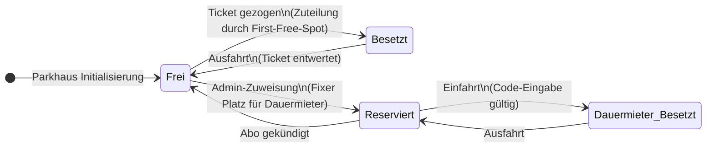

# Zustandsdiagramm

## Argumentation für deine Dokumentation (Kapitel: Design & Architektur)

Übernehme am besten folgende Erklärungen in deine Doku, um den "roten Faden"  zu beweisen:

Trennung der Lebenszyklen: Das Diagramm visualisiert, dass sich ein Parkplatz entweder im Zyklus eines Gelegenheitsnutzers (Frei ↔ Besetzt) oder im Zyklus eines Dauermieters (Reserviert ↔ Dauermieter_Besetzt) befindet.

Erfüllung von FA-60.2: Die im Diagramm definierten Zustände (Frei, Besetzt, Reserviert/Dauermieter_Besetzt) entsprechen exakt den geforderten UI-Statusanzeigen. Jede Zustandsänderung im Backend löst somit ein UI-Update in der Simulation aus.

Erfüllung von FA-30.3: Der Übergang von Frei zu Reserviert dokumentiert die Anforderung, dass Dauermietern ein fixer Parkplatz im System zugewiesen wird. Ein reservierter Platz wird vom "First-Free-Spot"-Algorithmus ignoriert und bleibt Gelegenheitsnutzern verwehrt.
