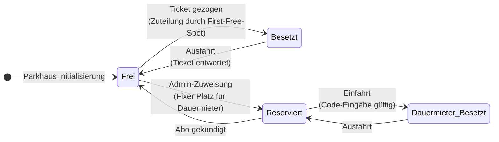

## 2.7 Zustandsdiagramme

Das nachfolgende Zustandsdiagramm veranschaulicht die möglichen Zustände und deren Übergänge für einen Parkplatz innerhalb der «EasyParking»-Software. Es fokussiert sich auf den Lebenszyklus eines einzelnen Stellplatzes und zeigt auf, wie das System auf Aktionen von Gelegenheitsnutzern, Dauermietern und Administratoren reagiert.

### Beschreibung der Zustände und Übergänge

Das Zustandsmodell ist bewusst in zwei getrennte Lebenszyklen unterteilt, wodurch die Systemlogik für Gelegenheitsnutzer und Dauermieter sauber voneinander entkoppelt ist:

*   **Zyklus für Gelegenheitsnutzer (Frei ↔ Besetzt):**
    *   Nach der Initialisierung des Parkhauses befindet sich ein ungenutzter Parkplatz im Zustand `Frei`.
    *   Zieht ein Gelegenheitsnutzer ein Ticket an der Eingangsschranke, weist der "First-Free-Spot"-Algorithmus dem Nutzer einen freien Platz zu. Der Status des Platzes wechselt auf `Besetzt`.
    *   Nach erfolgreicher Bezahlung und anschliessender Ausfahrt (Entwertung des Tickets) wechselt der Status wieder zurück auf `Frei`.

*   **Zyklus für Dauermieter (Reserviert ↔ Dauermieter_Besetzt):**
    *   Gemäss der Anforderung **FA-30.3** muss Dauermietern ein fixer Parkplatz im System zugewiesen werden. Sobald ein Administrator einen Stellplatz einem Dauermieter zuordnet, wechselt dieser vom Zustand `Frei` in den Zustand `Reserviert`. In diesem Status wird der Platz vom automatischen Zuteilungs-Algorithmus ignoriert und steht Gelegenheitsnutzern nicht zur Verfügung.
    *   Gibt der Dauermieter an der Eingangsschranke einen gültigen Code ein (**FA-20.2**), wechselt der physisch belegte Platz in den Zustand `Dauermieter_Besetzt`.
    *   Verlässt der Dauermieter das Parkhaus, kehrt der Platz wieder in den Zustand `Reserviert` zurück, da die exklusive Zuordnung zum Mieter bestehen bleibt.
    *   Wird das Abonnement des Dauermieters gekündigt, wird die Reservierung im System aufgehoben und der Platz steht als `Frei` wieder der Allgemeinheit zur Verfügung.

### Abbildung auf die Benutzeroberfläche (Design & Architektur)

Die hier definierten Systemzustände bilden direkt die Grundlage für die grafische Darstellung im Management-Dashboard (**FA-60.2**). Jede Zustandsänderung im Backend löst ein entsprechendes UI-Update in der Simulation aus. Die Zustände lassen sich somit exakt auf die geforderten UI-Statusanzeigen übertragen:
*   `Frei` → Grün
*   `Besetzt` → Rot
*   `Reserviert` / `Dauermieter_Besetzt` → Blau/Gelb

Durch diese direkte Koppelung von Backend-Zustand und Frontend-Visualisierung wird eine stets konsistente Echtzeit-Übersicht der Parkhausauslastung für das Personal garantiert.